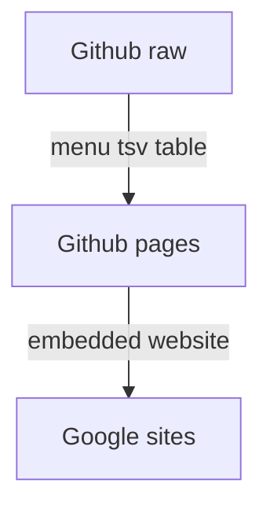

# brume-menu

Here is the menu website made with <3 by Simon for Roxane.

It is hosted by Google Sites and Github for free !

Visit us in Nice : https://goo.gl/maps/NQpQ787KMkiAHNmv6 :)

## Hosts
* Github hosts menu data as ```tsv``` table : https://raw.githubusercontent.com/simon-ameye/brume-menu/master/menu.tsv
* menu.html formats table data to HTML using JavaScript
* menu.html is hosted by Github pages : https://simon-ameye.github.io/brume-menu/
* Google sites hosts restaurant's website : accessible via https://www.brumecoffeenice.fr/
* Google sites menu page embeds Github page as an Embed Website Widget 

## Data
Data is fetched using : ```fetch().then()``` synchronously

## Processing
JavaScript function ```process(input)``` processes table data and returns HTML format string.

English translation is eventually available for each word.

```process``` tries to parse translation if ```var language = 1``` thanks to ```onclick``` event.

## Graph

