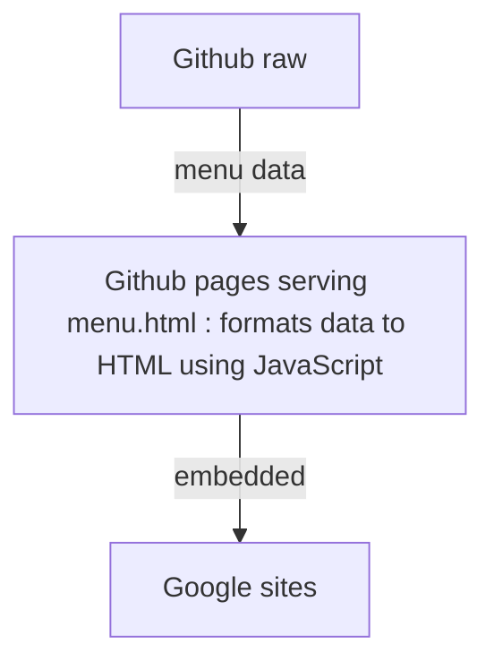

# brume-menu

Here is the menu of our restaurant.

Github pages hosts menu website : https://simon-ameye.github.io/brume-menu/menu.html

Github hosts menu data as ```tsv``` : https://raw.githubusercontent.com/simon-ameye/brume-menu/master/menu.tsv

Google sites hosts restaurant website : https://www.brumecoffeenice.fr/

Google sites menu page embeddes Github page

## Data
Data is fetched using : ```fetch()```

## Processing
JavaScript function ```process(input)``` processes table data and returns HTML format string.

English translation is eventually available for each word.

```process``` tries to parse translation if ```var language = 1``` thanks to ```onclick``` event.

